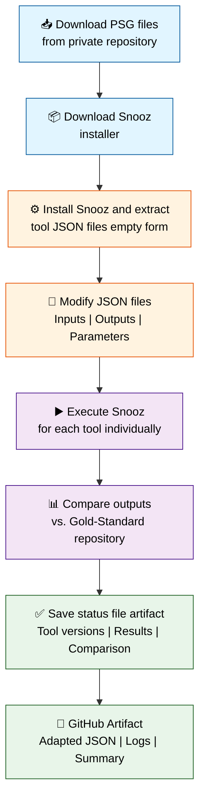

# Snooz Validation Workflow

## Overview

This workflow automates the validation of Snooz tools by:

1. Downloading PSG files from a private repository
2. Extracting tool definitions from the Snooz installer  
3. Adapting their JSON files to define inputs, outputs, and required parameters
4. Executing Snooz with each tool individually
5. Comparing generated outputs against a gold-standard repository
6. Recording validation results in an artifact

## Workflow Diagram

## Phases

### 🔵 Preparation Phase
- Download PSG files from private dataset repository
- Download Snooz installer release

### 🟠 Configuration Phase
- Install Snooz application
- Extract empty tool JSON files from package resources
- Modify JSON files with validation-specific inputs, outputs, and parameters

### 🟣 Execution Phase
- Execute Snooz headless mode for each configured tool
- Generate output artifacts (TSV files, logs, etc.)

### 🟢 Validation Phase
- Compare generated outputs with gold-standard reference files
- Record tool versions and comparison results
- Save comprehensive status report as GitHub artifact

## Key Features

- **CEAMS Compatibility**: JSON modifications remain compatible with future CEAMS package versions
- **Automated Testing**: Headless execution ensures consistent, reproducible results
- **Version Tracking**: Records exact tool versions and execution details
- **Output Validation**: Automated comparison against gold-standard repository
- **Artifact Recording**: Comprehensive logs and status files for audit trail

## Output Artifacts

- Adapted JSON scenario files
- Snooz process logs and execution logs
- Tool run summary (TSV format)
- Comparison results for each validated output
- Generated vs. reference file pairs
