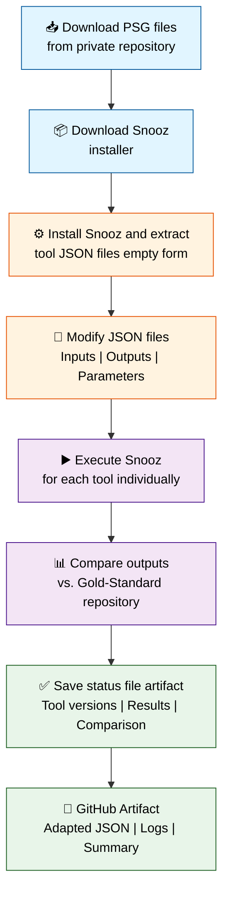

# Snooz Validation Workflow

## Overview

This workflow automates the validation of Snooz tools by:

1. Downloading PSG files from a private repository
2. Extracting tool definitions from the Snooz installer  
3. Adapting their JSON files to define inputs, outputs, and required parameters
4. Executing Snooz with each tool individually
5. Comparing generated outputs against a gold-standard repository
6. Recording validation results in an artifact

## Workflow Diagram


```mermaid
graph TD
    A["📥 Download PSG files<br/>from private repository"] --> B["📦 Download Snooz<br/>installer"]
    B --> C["⚙️ Install Snooz and extract<br/>tool JSON files empty form"]
    C --> D["🔧 Modify JSON files<br/>Inputs | Outputs | Parameters"]
    D --> E["▶️ Execute Snooz<br/>for each tool individually"]
    E --> F["📊 Compare outputs<br/>vs. Gold-Standard repository"]
    F --> G["✅ Save status file artifact<br/>Tool versions | Results | Comparison"]
    G --> H["📁 GitHub Artifact<br/>Adapted JSON | Logs | Summary"]
    
    style A fill:#e1f5ff,stroke:#01579b,color:#000
    style B fill:#e1f5ff,stroke:#01579b,color:#000
    style C fill:#fff3e0,stroke:#e65100,color:#000
    style D fill:#fff3e0,stroke:#e65100,color:#000
    style E fill:#f3e5f5,stroke:#4a148c,color:#000
    style F fill:#f3e5f5,stroke:#4a148c,color:#000
    style G fill:#e8f5e9,stroke:#1b5e20,color:#000
    style H fill:#e8f5e9,stroke:#1b5e20,color:#000
```

## Phases

### 🔵 Preparation Phase
- Download PSG files from private dataset repository
- Download Snooz installer release

### 🟠 Configuration Phase
- Install Snooz application
- Extract empty tool JSON files from package resources
- Modify JSON files with validation-specific inputs, outputs, and parameters

### 🟣 Execution Phase
- Execute Snooz headless mode for each configured tool
- Generate output artifacts (TSV files, logs, etc.)

### 🟢 Validation Phase
- Compare generated outputs with gold-standard reference files
- Record tool versions and comparison results
- Save comprehensive status report as GitHub artifact

## Key Features

- **CEAMS Compatibility**: JSON modifications remain compatible with future CEAMS package versions
- **Automated Testing**: Headless execution ensures consistent, reproducible results
- **Version Tracking**: Records exact tool versions and execution details
- **Output Validation**: Automated comparison against gold-standard repository
- **Artifact Recording**: Comprehensive logs and status files for audit trail

## Output Artifacts

- Adapted JSON scenario files
- Snooz process logs and execution logs
- Tool run summary (TSV format)
- Comparison results for each validated output
- Generated vs. reference file pairs
- All files created, modified, or deleted by each tool under `private-dataset/` and `validation-workspaces/`
- Cumulative checkpoints that reproduce the state immediately before each tool

### Captured outputs and checkpoints

Captured files are stored separately from gold-standard comparison files so comparison cleanup cannot remove them. Windows, Linux, and macOS artifacts use the same short, flat capture layout to reduce Windows Explorer extraction path lengths:

```text
captures/
    01-ToolName/
        output.tsv
        changes.json
validation-captures/
    checkpoint-state/
        (internal state, not archived)
    checkpoints/
        (generated locally, not archived in artifacts)
```

`changes.json` lists files created, modified, and deleted by one tool. Each file record retains its original root-relative `path` and a `captured_path` relative to the tool folder. Unique basenames are preserved. Case-insensitive duplicate basenames and the reserved name `changes.json` receive a source-path hash suffix, with a shortened stem, to prevent overwrites. Capture copy failures are recorded in `copy_errors` and fail the workflow on every platform.

**Artifact contents:** Only `captures/**/*` is included in GitHub artifacts. The `validation-captures/` folder is used internally during the workflow for checkpoint state and local checkpoint generation, but is not archived. This avoids the Windows 260-character path limit issue when extracting archives.

**Checkpoint restoration (if needed locally):** Checkpoint contents and restoration instructions are unchanged; extracting checkpoints locally may still require a short destination path or a long-path-capable extractor. However, users receive only the final `captures/` output which has flat names suitable for immediate use.

### Tool execution order

The cross-platform execution order is defined in `ci/validation_tools/tool_execution_order.json`. Windows, Linux, and macOS all use this list. The optional `tools_to_process` input selects a subset but does not change the relative order.

Every tool with non-empty `updates` in `tool_json_adaptations.json` must appear exactly once in the execution-order file. The workflow fails during preparation if a configured tool is missing or an unknown tool is listed. When adding `SlowWaveDetection`, add it to `tool_execution_order.json` at the point where its required input state is available, for example immediately after `ScoreSleepStagesYASA`.
